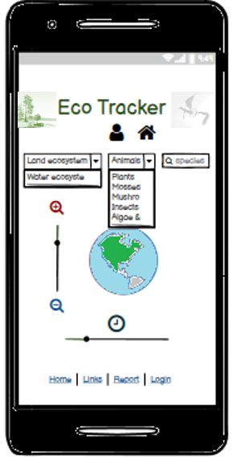

# Ecotracker

#### The aim of this app is to in a easy way visualize, receive and report species find at different locations. 

##### Today there is an increasing interest for the nature and the environmental debates are flourishing on media. Even so there is a lack of alternatives for common people to find informations about which species that are found at different locations which is easily accessible, simple to use and visual appealing. Our ambition is to offering an app where you can get informations about which species that is found at different locations and make it available for common people. In the long run we hope this will inspire people to learn more about the nature and increase the interest for our environment. The information available today could be presented in a much  simpler way and more easy to use and is mostly used by researcher and by people with high dedication for the nature. Our aim is to make this information easy available for common people and contribute with a growing interest and awareness amongst common people for the nature. 
 
## UX

### User story
#### We aspect this application to be used as a complement to traditional platforms. 

#### Typical user would be 
- People that are curious about the nature and interested in what they can see at different locations
- Researcher
- People engaged in nature and environmental associations (eg. Birdwatcher)

#### We suppose users in the three categories above will be in the agespan between 14 to 65 year

#### These three categories have different needs

- People that are curious about the nature are aspected to 
ask for an app that is easy-to-us, intuative and visual 
appealing which present informations about the nature in the region they 
are visiting. Probably the need for this information is
most common when visiting a region or being out in the nature. 
Therefore the first choice of devices used to finding this information
are in most cases mobile devices.

- Researcher need a tool where they can select, report, extract, and evaluate data connected to the nature. 
Their first choice of devices when working with data is probably a large device such as a computer. 
For collecting data in field they probably prefer a small devices such as a mobile telephone.

- People engaged in nature and environmental associations have similar needs as a researcher. They probably use 
a mobile telephone to navigate and report what they see in nature. For making analysis and
evaluate reported data they are supposed to use a large device such as a computer.

#### The wide age-range could be divided into smaller categories after their expectation

- 14- 25 years are looking for something with a 
WOW-factor something new and trendy with a cool and 
interactive design which could be viewed on a mobile telephone.

- 25- 45 years are looking for a clear, informative app where it is easy to find and evaulate information, which is applicable both on computer and mobile devices

- 45 - 65 years are looking for a simple, easy-to-use and informative app, not so much pop-ups and extra informations, their first alternative are probably to use a computer

### Decisions to make

The different user and age-spans have different needs and expectation therefore we have to find a compromise on how this app should be set up.
#### Decisions to make are 
- Weither the contents should be written in local language or in English.
- If it should be appealing for the older or younger age span
- If it should have simple or functional advanced appearance

#### Decisions made for the first protype are

1. The app should be made for small media devices
2. It should present data in a simple way and be easy-to-use
3. The main focus is to get information of species that could be found at the users current position
4. As an option the users should be given the possibility to report which species they find at different locations
5. The data should be collected, sent and stored at an external database

#

Problems/Opportunities | Importance | Viability/Feasibility|
-----------------------|------------|----------------------|
Create an app dedicated for mobile devices|5|4
Collect, send and store data in an external database |5|2
Visualize data on a map |5|2
Adjust the design after user categories|3|3
Create an online presence |	4|4
Conduct a market research|4|	2
Draw attention via Social media|	2	|3
|||
Sum	|28	|20

#

### Wireframe
[Ecotracker app](assets/documents/Ecotracker.pdf "Wireframe app")

#

### Analysis of Strength, Weakness, Opertuinity, Treats

#### Strength 
- Easy-to-use, easy to navigate, visual appealing, data presented
in a easy-understandable way and is simple to use to get oriented 
and get information about the local regions. We have an ambition to go 
global and therefore is not restricted to a specific country. 

#### Weakness
- Not the only alternative on the market. The traditional platforms have a large 
customer base that are confident with their solutions. Further more the traditional platforms also
have an extensive knowledge and great experience of taxonomy. 

#### Opportunity
- Cooperate with traditional actors to increase the general interest for the nature,
increase data collection by introducing new users and assure a high standard of validation
by using databases connected to traditional platform
- Increase visitors/users to the app by introducing it on social media
- Make it easy to find the app through search-optimising
- Keep visitor coming back to the app by introducing new features

#### Treats
- Unable to find synergistic agreements with traditional actors.

## Features

### Prototype
#### The first app should have a clean, simple, intuitive design with functions that are easy-to-use and covers the basal requirements of the users.  The app should first of all be optimized for small media devices.

Features|	Content	|Difficulty level
--------|-----------|----------------|
Framework| Main page, Profile page, Forms (Login, Report, Update Profile info),  History page, Link page |2
Simple, clean, intuative design| Header, Search field/Nav bar, Section Div, Footer| 1
|||
Head | Title and content| 1
Main page: Header|Logo, Home & logIn-to-profile-page buttom |1
Main page: Search field | Search options connected to external database and the outcome is presented in Homepage Section Div|4
Main page: Section Div | Selected options from Search field presented on an interactive map with possibility to zoom and see how the input change over time|4
Main page: Footer | Links to Main page, Link page, Report form, Profile-page|1
|||
Form: LogiN| With Redirection to log in at external partners site|4
|||
Profile page: Header|Logo, Home & logIn-to-profile-page, report buttom |1
Profile page: Nav bar |Links to Profile & History page plus Update profile form|1
Profile page: Section Div | Picture & Contact Info |2
Profile page: Footer | Links to Main page, Link page, Report form, Profile-page|1
|||
Form: Report | Linked to external database | 4
Form: Update Profile info|Updates info i Profile pages Section Div|2
|||
History page: Header|Logo, Home & logIn-to-profile-page, report buttom |1
History page: Nav bar |Links to Profile & History page plus Update profile form|1
History page: Section Div | With options to present reported data in a table view or on a map|4
History page: Footer | Links to Main page, Link page, Report form, Profile-page|1
|||
Link page: Header|Logo, Home & logIn-to-profile-page buttom |1
Link page: Search field | Search options connected to external database and the outcome is presented in Homepage Section Div|4
Link page: Section Div | Links with future information about ecology | 1
Link page: Footer | Links to Main page, Link page, Report form, Profile-page|1
		
#

### Time plan

#### Part 1. Visual Design and Basal app structure

1. Construct a Main page-template readable in small media devices such as mobile telephone, use HTML, CSS, Bootstrap.
2. Test and validate the design through google inspection tool & lighthouse
3. When satisfied with the design of the Main page use this template to construct Profile, History and Link page
4. Test and validate the design through google inspection tool & lighthouse
5. Contruct a form for login to profile page
6. Test and validate the form through google inspection tool & lighthouse
5. Contruct a form for updating profile info
7. Test and validate the form through google inspection tool & lighthouse
8. Contruct a form for report species
9. Contruct a form for confirming validity in reported data
10. Construct a form accepting redirection to login at external partners
11. Test and validate the whole design through google inspection tool, lighthouse and CCS3/HTML-validator
12. Validate the code via CSS & HTML validator
13. Push code to GITHUB
14. Deploy repository to masterbransch
12. Collect feedback regarding the visual design

#### Part 2. Add functions

1. Build a protocol for safe login at external partnerns
2. Test and validate the function through google inspection tool & lighthouse
3. Connect and exchange information with external database
4. Link external database to Search field & Section Div at Main page and to the Report Form
5. Test and validate the function through google inspection tool & lighthouse
6. Clone informations sent via Report form to external database to the Section Div at the History page
7. Test and validate the function through google inspection tool & lighthouse
8. Add a map to Section Div at Main page and to Section Div at History page
9. Connected selected information choosed by the Search field and visualize it on the map in the Homepage Section Div
10. Test and validate the function through google inspection tool & lighthouse
11. Connected reported information to the map in the Section Div at the History page
12. Test and validate the function through google inspection tool & lighthouse
13. Validate the code via CSS & HTML validator
14. Push code to GITHUB
15. Deploy repository to masterbransch

##### Part 3. Evaluate app

1. Use google ananlytics to see behavoir and traffic on the homepage
2. Adjust the platform from conclusion made

##### Ideas for future release
1. Add options to export Reported history as eg. CSV, TEXT or PDF-file
2. Add options to use camera for image recognition of species
3. Add picture and sound connected to selected species

## Technologies that will be used

#### HTML, CSS, Bootstrap, fontawesome, Google analytics, python??, javascript??

## Testing

#### 
1. At early stage lighthouse and google inspections tool will be used, to assure for good and stable design
2. After assuring stable visual appealing  design the commited code will be deployed through GITHUB masterbranch,
the deployed site will be sent out to beta-tester for feedback
3. The platform will be update in accordance with feedback from beta-tester
4. The updated site would once more be tested via google inspection tool and lighthouse
5. When the design is consider to forfill all requirements from above inspection tools, the code will be validated via CSS3/HTML-validation tool
6. After assuring a good and stable code the project will be deployed and sent to mentor for comments

## Deployment

##### The code is made using Gitpod-editor 
##### The code will be pushed to GITHUB through using
- git add, git commit and git push commands
##### In GITHUB repository the code will be deployed to a masterbransch

## Credits

### Content
- will be added continuosly

### Media
- - will be added continuosly

### Acknowledgements

- will be added continuosly
